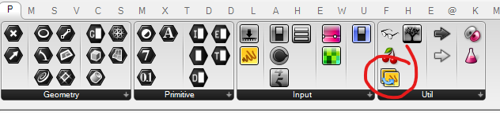

### DefaultPanel
We have scripts shared by several users and sometimes people overwrite the values in the panels and other people forget what the default values were.

With this little snippet you can connect a source and a target panel using right click. If you double click on the component it will copy content to the target.

### TODO
- Still working on a way to activate all of them in the file... Help appreciated.
- Need to add a grasshopper "undo event" when activating.

USE AT OWN RISK!

highly based on the ScriptSync code by Long Nguyen

